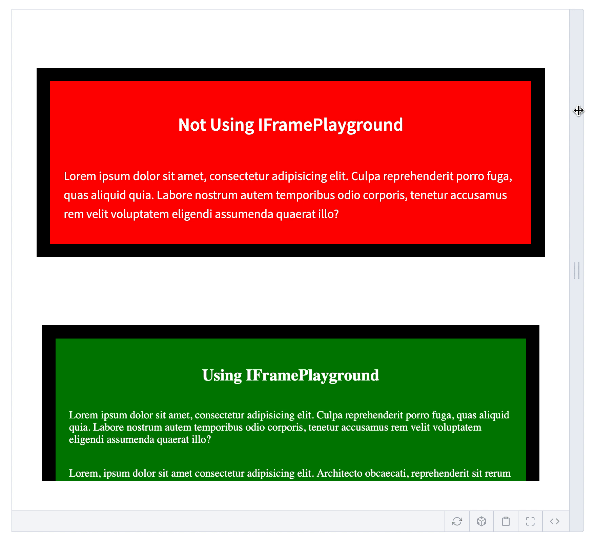

# Docz IFrame Playground

The default Docz `<Playground>` is really cool, but it does not serve your components in an **isolated browsing context**. This means your components live in a shared document environment with the Docz theme

The disadvantages of shared browsing context are:

- It makes developers hard to test component responsiveness
- Possible CSS collisions between Docz default theme style and component style

This project aims to solve the issue by using `<iframe>`

## Demo



Playground: https://zicodeng.github.io/docz-iframe-playground/

## Installation

```shell
yarn add -D docz-iframe-playground
```

## Usage

```mdx
---
name: IFramePlayground
route: /
---

import { Playground, PropsTable } from 'docz';

import IFramePlayground from './../src/IFramePlayground';
import TestComponent from './TestComponent';

# IFramePlayground

## Demo

### You can nest `<IFramePlayground>` under `<Playground>`

<Playground>
  <TestComponent title="Not Using IFramePlayground" />
  <IFramePlayground style={{ marginTop: 50 }}>
    <TestComponent title="Using IFramePlayground" />
  </IFramePlayground>
</Playground>

### You can also use standalone `<IFramePlayground>`

Make sure to turn on `enableResizing`

<IFramePlayground enableResizing>
  <TestComponent title="Using IFramePlayground" height="100%" />
</IFramePlayground>

## API

<PropsTable of={IFramePlayground} />
```
